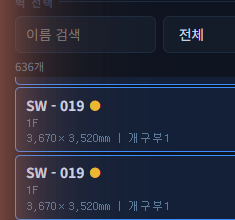

# IFC 원본 오류 사항

> 작성일: 2026-06-23  
> 대상 파일: `광건기숙사통합본_2026.0409_영역설정.ifc`  
> 발견 경위: 석고보드 배치 최적화 시뮬레이터 실행 중 이상 현상 확인

---

## 오류 1: 개구부 x좌표 이상 — 벽 범위 밖에 개구부 위치

### 발생 위치
- 벽 ID: **SW-019** (1F, B동-사무실)
- 벽 크기: 3,670 × 3,520mm

### 현상
시뮬레이터 우측 패널에서 SW-019의 개구부 좌표가 다음과 같이 표시됨:

```
□ 2000 × 1200mm  @x = 1,856,000mm
```

벽 가로 폭이 **3,670mm** 인데, 개구부의 x좌표가 **1,856,000mm (= 약 1,856m)** 로 표시됨.  
→ 벽 범위(0 ~ 3,670mm)를 **506배** 초과한 위치에 개구부가 기록되어 있음.


### 추정 원인
`ifc_verifier.py`에서 개구부 위치를 벽 로컬 좌표로 변환하는 과정:

```python
wall_inv = np.linalg.inv(wall_mat)
local_mat = wall_inv @ op_mat
ox = round(abs(local_mat[0][3]) * 1000, 1)  # m → mm 변환
```

`wall_inv @ op_mat` 결과가 전역 좌표계 기준으로 남아 있을 경우, `* 1000` (m→mm) 변환 후 수백만 mm 값이 됨.  
→ IFC 파일 내 개구부(`IfcOpeningElement`)의 ObjectPlacement가 벽 로컬 좌표가 아닌 **전역 좌표로 정의**되어 있어 변환 계산이 실패한 것으로 추정.

---

## 오류 2: 개구부 좌표 오류로 인한 보드 미배치 (캔버스 상단 빈 공간)

### 발생 위치
- 벽 ID: **SW-019** (동일)

### 현상
SW-019 배치 결과 캔버스에서 **상단 약 100mm 영역에 석고보드가 배치되지 않음** (어두운 빈 공간).

- 하단 행: 온장 보드 (녹색, GYP-002~005)
- 상단 행: 직선절단 보드 (노란색, GYP-007~010)
- 최상단: **어두운 빈 공간** (보드 없음)


### 추정 원인
배치 알고리즘(`gypsum_optimizer_v3.py`)이 개구부를 기준으로 구역을 분할:

```
[0 ~ oy]         ← 개구부 아래 (보드 정상 배치)
[oy ~ oy+oh]     ← 개구부 위치 (보드 없음)
[oy+oh ~ H]      ← 개구부 위 (보드 배치)
```

개구부 x좌표는 잘못됐어도 **y좌표(높이 방향)** 도 잘못 계산되었을 가능성이 있어, 개구부가 벽 상단에 위치한 것으로 처리되어 그 구간에 보드가 배치되지 않음.

---

## 오류 3: 개구부 표시 불일치 (노랑 ● 있으나 캔버스에 개구부 미표시)

### 발생 위치
- 벽 목록 상 다수 벽 (SW-019, SW-011, SW-012, SW-080 등)

### 현상 A — 노랑 ●이 있는데 캔버스에 개구부가 안 보임
벽 목록에서 노랑 ●(개구부 있음 표시)가 붙은 일부 벽의 캔버스에서 개구부 마커가 렌더링되지 않음.



**원인**: 개구부의 x/y 좌표가 벽 범위 밖으로 벗어나 있어 캔버스 렌더링 영역을 벗어남.  
→ IFC `HasOpenings` 관계는 존재하나 좌표가 잘못된 경우.

### 현상 B — 개구부가 실제로 있는데 노랑 ●이 없는 경우
일부 벽에 실제 문/창문이 있음에도 불구하고 벽 목록에 노랑 ●이 표시되지 않음.

**원인**: IFC 파일에서 해당 문/창문 요소(`IfcDoor`, `IfcWindow`)가 벽과 `HasOpenings` 관계로 연결되지 않고 독립적으로 배치된 경우.

---

## 요약

| # | 오류 유형 | 영향 벽 예시 | 원인 |
|---|-----------|-------------|------|
| 1 | 개구부 x좌표 이상 (1,856,000mm) | SW-019 | IFC 개구부 전역좌표 → 로컬 변환 실패 |
| 2 | 캔버스 상단 보드 미배치 | SW-019 | 개구부 y좌표 오류로 배치 구역 계산 이상 |
| 3-A | 노랑 ● 있는데 개구부 캔버스 미표시 | SW-019, 기타 | 개구부 좌표가 벽 범위 초과 |
| 3-B | 개구부 있는데 노랑 ● 없음 | 미확인 다수 | HasOpenings 관계 누락 (IFC 저작 오류) |

---

## 조치 필요 사항

1. **IFC 원본 파일 수정**: 개구부(`IfcOpeningElement`)의 `ObjectPlacement` 확인 및 벽 로컬 좌표 기준으로 재정의
2. **누락된 HasOpenings 관계 추가**: 문/창문과 벽 간의 관계가 누락된 요소 재연결
3. **확인 도구**: Revit / ArchiCAD / BIMcollab 등에서 해당 벽의 개구부 위치 재검토 권장

---

*본 문서는 석고보드 배치 최적화 프로그램 실행 중 자동 발견된 IFC 데이터 오류를 정리한 것입니다.*
